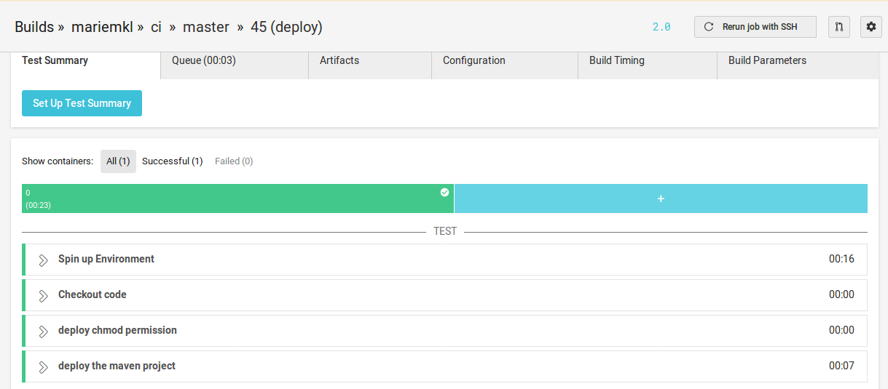

# TP : Système d’intégration continue - Circleci -

Pour commencer à utiliser Circleci on commence à partir de la page d’inscription de Circleci qui propose de démarrer avec notre compte github et puis donner accès à notre compte github pour executer les différents builds. 
Circleci utilise un fichier YAML nommé « config.yml » pour identifier la configuration de l’environnement de codage ainsi que les différents tests à executer. Ce fichier doit être mis dans un dossier caché portant le nom « .cirleci ». 

Dans l’interface de Circleci, on choisit le projet sur lequel on souhaite travailler  « Setup project »
et dans la page qui s’affiche on clic sur  « start building » .

Avec chaque modification sur le github on parviens à voir si les différents « job » définis dans config.yml sont bien exécutés ou pas .

Pour voir une représentation du pipeline défini dans le fichier config .yml il faut définir un workflow qui réuni tout les jobs. La représentation est consultable dans la page « workflow » de notre circleci.

## Description du pipeline : 

Le pipeline crée se compose de cinq étapes différentes :
build : permet de construire le code du projet
cache : sauvegarder dans le cache les « dependency » définie dans le fichier pom.xml du projet java.
test : tester le code
hold : attend une interaction humaine pour pouvoir déployer le code
deploy : déploie le code (script : deploy.sh )

Une condition a été ajoutée pour que seuls commits de la branche master pourront faire le déploiement du code. 

Dans les paramètre avancés on peut activer l’option « Only build pull requests » qui permet de construire, par défaut, que les pull request de toutes les branches. Par contre pour la branche master, le code sera construit pour tout les « commit ».

